# Sistema de Registro de Actividades y Eventos Académicos.

### 1.- Pagina principal
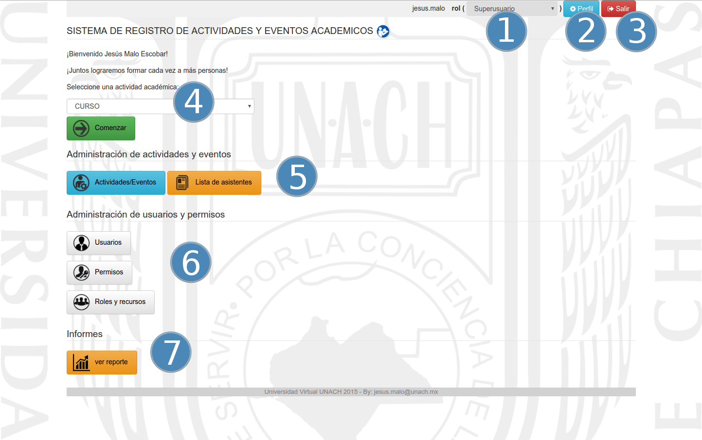

### 2.- Seleccion de tipo de actividad
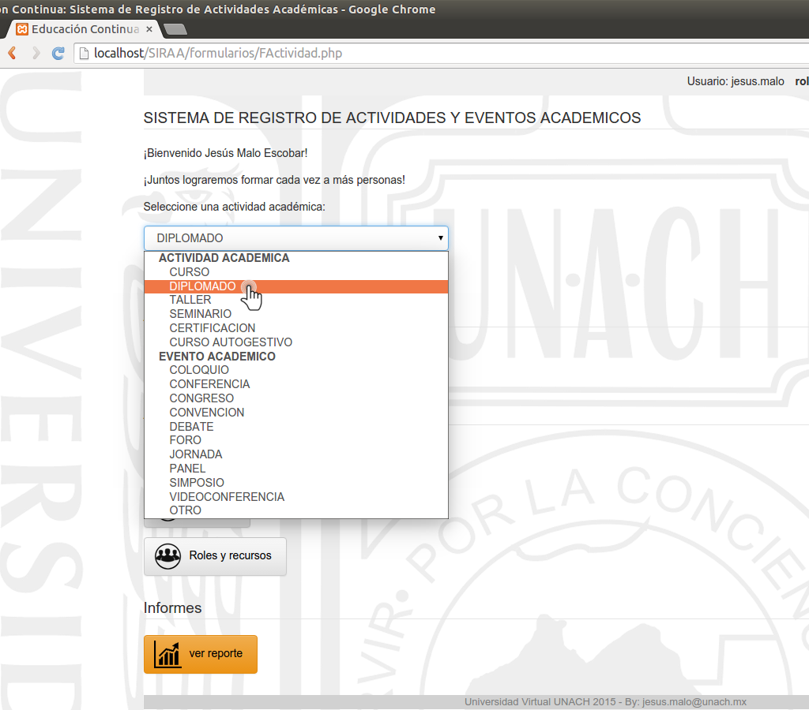

### 3.1 Requisitos Estructurales
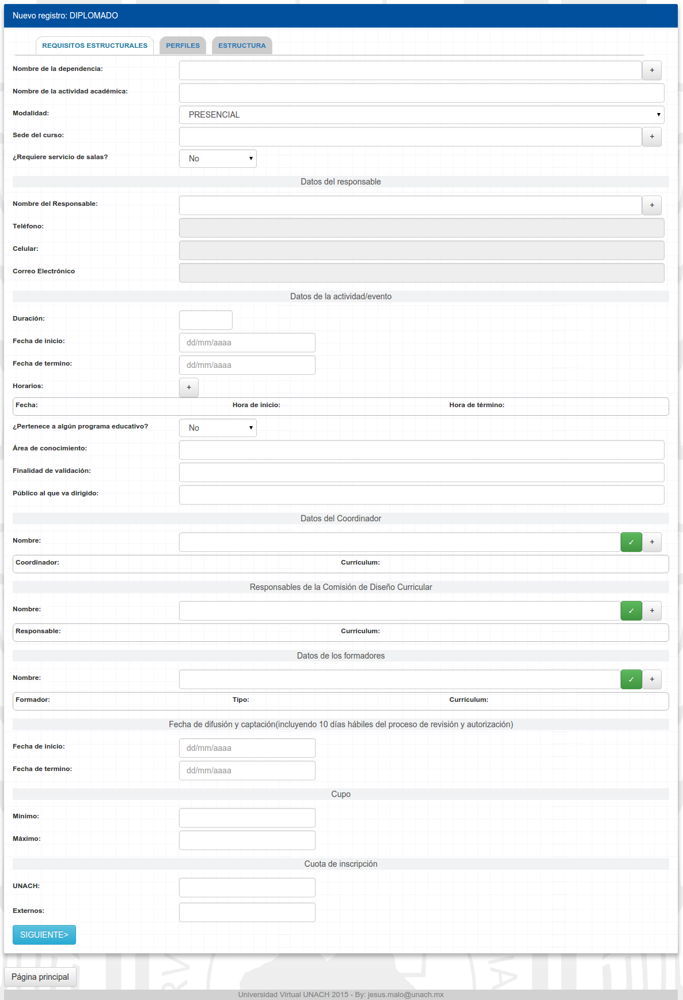

### 3.2 Perfiles
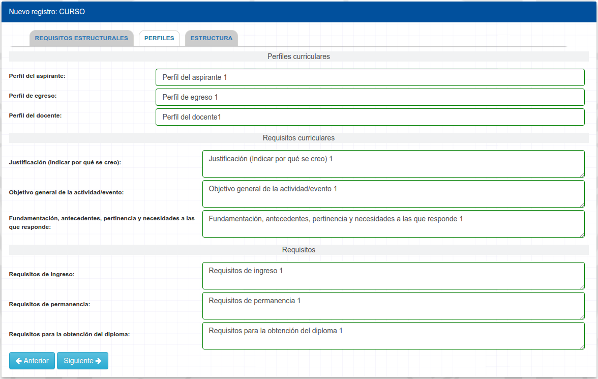

### 3.3 Estructura
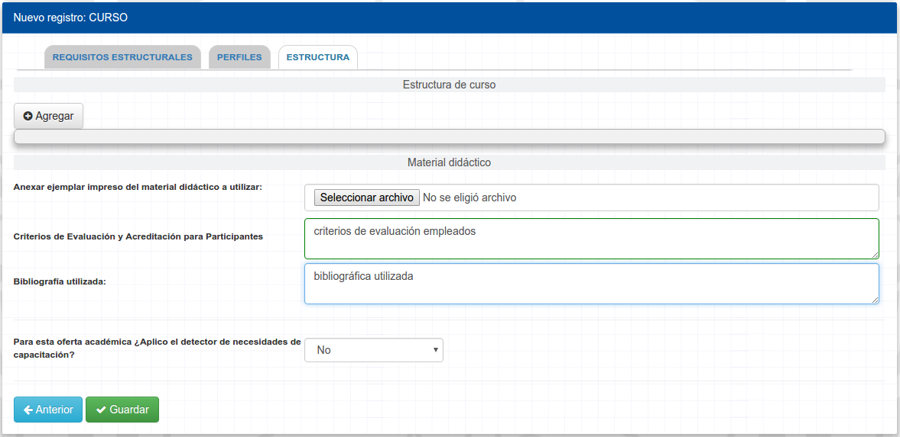

### 4.- Aprobacion y Foliado de Actividades/Eventos
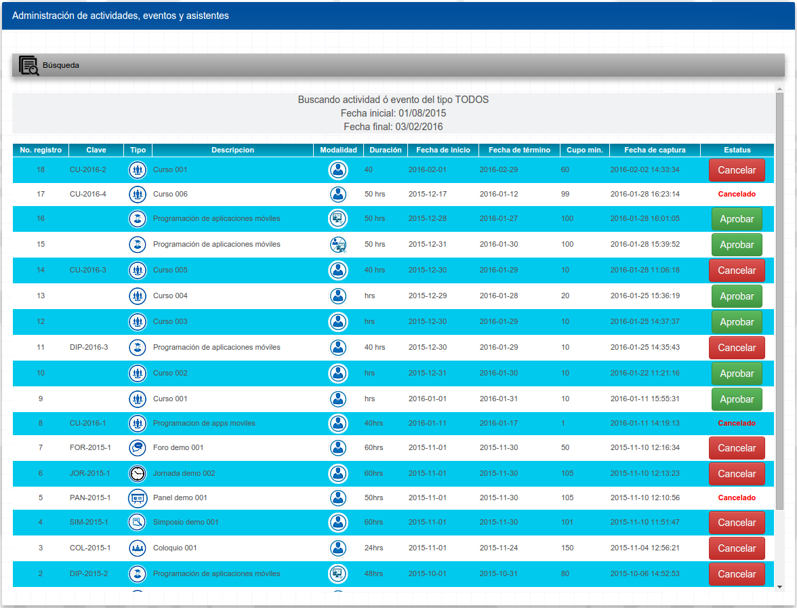

### 5.- Participantes
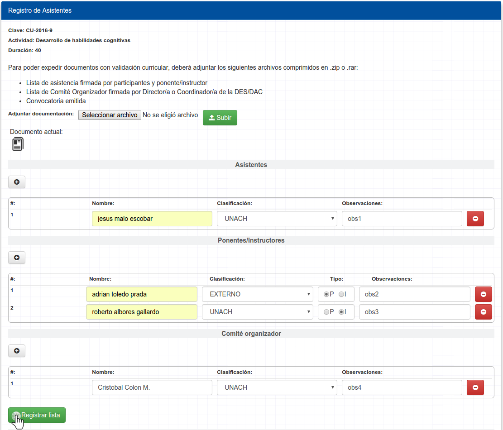

### 5.1 Aprobación de participantes
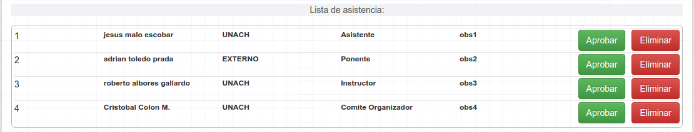

### 5.2 Foliado de Participantes

### 6.- Reportes
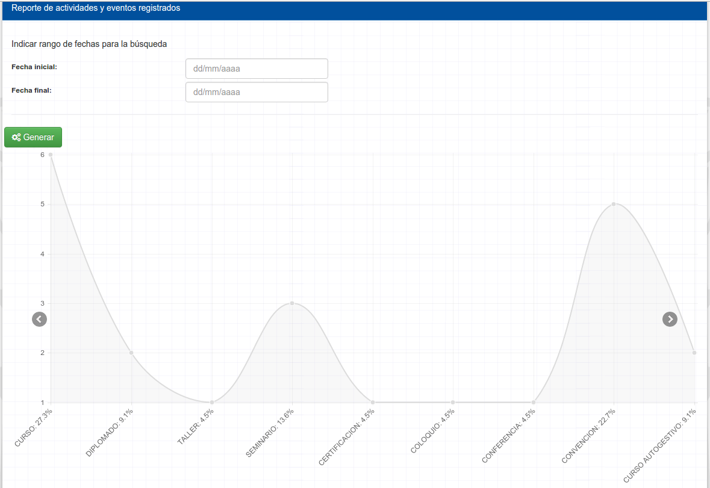
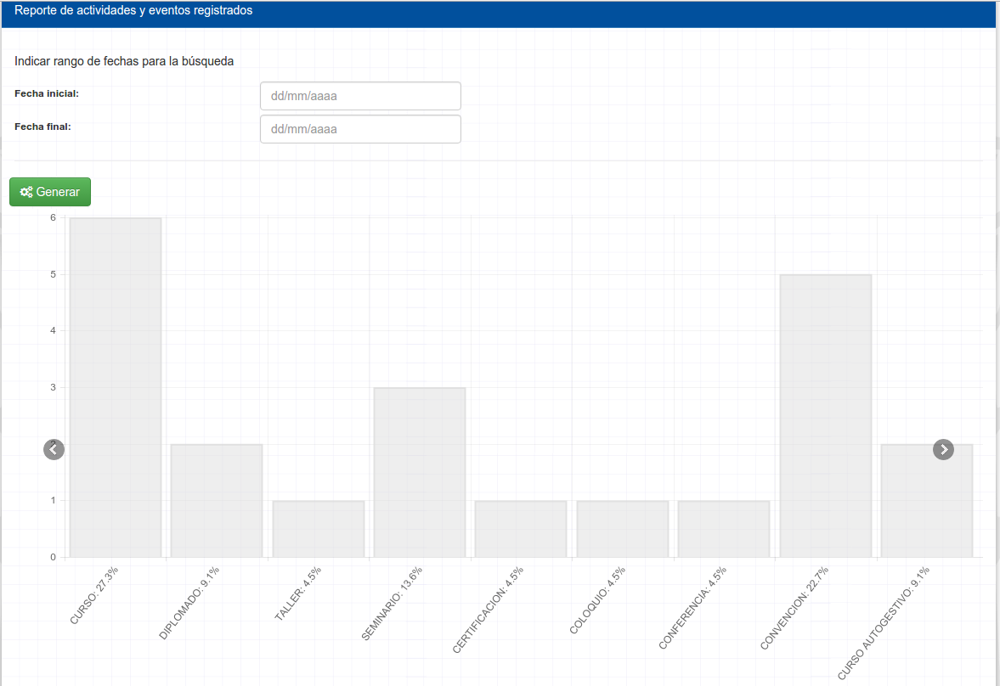
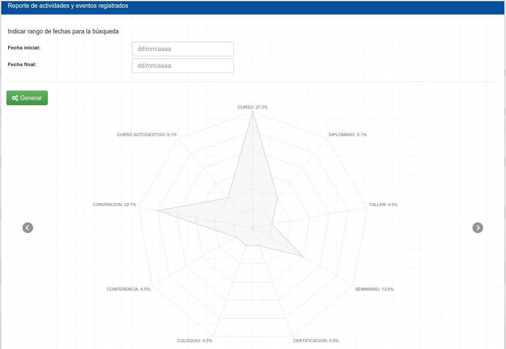
