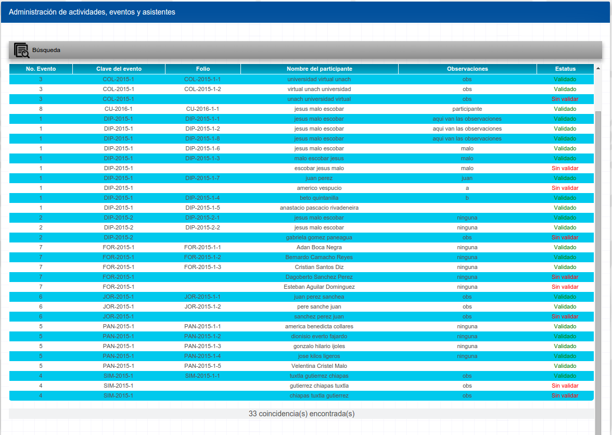

# Sistema de Registro de Actividades y Eventos Académicos.

### 1.- Pagina principal

### 2.- Seleccion de tipo de actividad

### 3.1 Requisitos Estructurales

### 3.2 Perfiles

### 3.3 Estructura

### 4.- Aprobacion y Foliado de Actividades/Eventos

### 5.- Participantes

### 5.1 Aprobación de participantes

### 5.2 Foliado de Participantes

### 6.- Reportes

